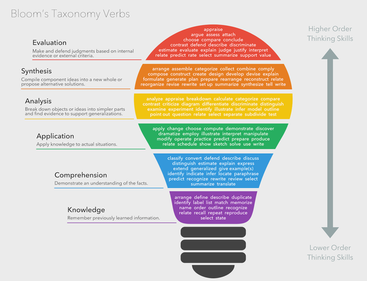
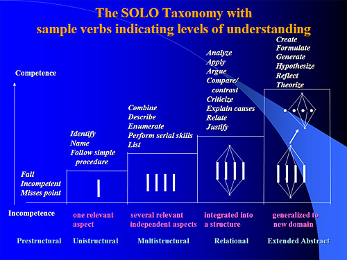

```{r setup, include=FALSE}
knitr::opts_chunk$set(echo = TRUE)
```

### Introduction
I will begin my description of how I plan, teach and support learning by mentioning briefly the theories of
learning that guide me, most of which I became formally aquanted with during my study of EEE730 - 
Contextualising Learning and Teaching in Higher Education. My teaching is mostly influenced by Constructivism,
Social Learning Theory, Feminism and Humanism. The works of Professor Eric Mazur strongly resonate with me,
in particular his approaches to the flipped classrooms, skill development, measuring learning outcomes and
assessment (Mazur 2013). The primary thesis of Mazur is that 
education is much more than the transfer of information, rather, meaningful skills are developed with 
communication, practise and trial and error. It is with practise and self-knowledge that learners reflect on
the importance of learning as a lifelong journey. In this paper I will be describing the process that I
undertake to deliver a unit from planning through to feedback and assessment. 

### Planning constructive alignment
Planning is the most important aspect of delivering a unit. For a unit to be successful, the goals of the 
unit need to be clearly defined and fit coherently within the graduate learning goals for the course. 
The learning outcomes need to be commensurate for the level of study, that is neither too simple nor too
complex. The learning outcomes need to be highly specific. The learning goals for the unit need to be 
aligned with the assessment tasks and the learning activities. This alignment of goals from the course level
through to units, assessments, learning activities and student support is called contructive alignment 
(Biggs and Tang 2011, p11). If these are not aligned, the learning experience of the students is diminished.

If learning outcomes overlap between units, it can diminish student enthusiasm and waste student and teacher
efforts. If assessments that are not aligned to the learning outcomes, it can cause students to become cynical.
Students begin to think that the assessments are simply boxes to tick , hurdles to summount, busy-work. Students
see the unit as disjointed and a waste of time and only engage at a surface level (Biggs and Tang 2011, p24). If
learning activities do not align with what is assessed, students will either not engage with these activities or
when they do engage, feel they have not been properly rewarded for doing so 
(Biggs and Tang 2011, p35). 

In summary, formulating unit learning outcomes (ULOs) is critical. When doing this, I always remind myself 
as to what are the graduate learning outcomes are for the course. I see that as the end goal. I always
seek advice from course coordinators, who generally have a good overview of the areas that need attention 
in a course. I review the learning outcomes for the other units that students will complete in their course. 
If the unit at hand is prerequisite for later units, I will study the unit guide of that unit and discuss with the
unit chair to identify exactly what requisite knowledge and skills are required.

Using this approach, I can focus on the specific skills that need to be emphasized in the unit I am planning. It 
is important that the ULOs are specific. Saying students should "understand concept X" is unsatisfactory because
understanding can be superficial or deep. I refer to the verbs in Bloom's and Structure of the
Observed Learning Outcome (SOLO) taxonomies and select the highest level that is realistic for most students to attain (Figure 1 and 2). 



__Figure 1.__ Verbs from Bloom's taxonomy are useful in formulating well defined ULOs. Graphic source: Fractal Learning 2017).



__Figure 2.__ The SOLO taxonomy outlines the different levels of understanding that a learner can achieve on a particular topic. Graphic source: Biggs (2013).

Four or five specific and well crafted ULOs that span medium to high levels of the taxonomy is appropriate. This is
in contrast to conventional units where there could be up to 10 different topics taught. A skilled unit designer
will be able to identify and emphasize the core and threshold concepts that interweave the different topics 
together. It is also more likely that these core and threshold concepts are retained by students into later life as
compared to the details "covered" in the 10 different topics. ULOs must focus on what students are required to _do_
with the knowledge and skills they have  attained. In the end it is what the student _does_ which is more important
than what the student _is_ or the teaching styles used (Biggs and Tang 2011, p20).

When a lecturer is tasked with chairing an existing unit it is tempting to keep every aspect of the unit the 
same as the last iteration. Indeed university processes make it difficult for unit chairs to make sweeping 
alterations to the unit structure. However, constructive alignment is something that will improve student 
satisfaction with a unit and make it a more enjoyable experience for the teaching staff as well. 

### Planning assessment tasks

I prefer to design the assessment tasks before the learning materials themselves because this is actually how many
students approach their studies, in a process I call "least resistance learning". This group of student will read
the assessment tasks ( & rubrics)  for a unit first and then selectively pick out the learning activities and
readings specifically focused to achieve satisfactory academic results for these assessments. By designing quality
assessments that focus on higher level understanding, this group of students will need to engage deeply to complete
the assessments.

The specific verbs used in the design of ULOs are particularly helpful in designing assessment tasks. It also 
reinforces to teachers to design assessment tasks that reach higher in the taxonomies. In the units I teach, the
__major assessment tasks__ focus on "apply, analysis, creation and evaluation" where the student can showcase their
ability to meet the ULOs. Because we are asking students to undertake sophisticated tasks, we should ensure that
they are not burdened with many overlapping activities and tasks. These higher level tasks require significant
effort and time and so they are not suited to assessment in conventional closed book examinations. They are more
suited to assignments/projects and may be most effective as group exercises.

The __minor assessment tasks__ should be picked from the middle of the taxonomy to make sure that students 
can "describe", "compare/contrast", "relate" and "apply" the threshold and core concepts for a unit. This is a way
in which students can identify blindspots in their understanding. This type of assessment would be suited to a 
quiz/test, report, essay or oral presentation.

Feedback is an absolutely essential component of learning but unfortunately assessments such as end of unit 
examinations are not consistent with this nor lifelong learning. Feedback needs to be build into several levels 
of a unit including results in assessment tasks ("points") but also in being able to obtain feedback on preliminary
work by the student, formative assessment and in class activities. 

__Formative assessments__ have proven to be very useful in one of the units I run where the students are from
diverse backgrounds and different levels of proficiency in a particular task (writing a scientific laboratory 
report). By offering formative assessments and integrating these into class activities, I can be certain that
students who have engaged in the unit have the opportunity to work on their weaknesses so that they are well 
equipped when it is time to complete the summative assesments. Yes, it involves more work on behalf of the teaching
team, but it can be minimised if evaluation of formative assessments is worked into the in-class activities.

### Planning for effective teaching and active learning
When we think of university lectures, we imagine huge auditoriums focused on the lone presenter behind the
lectern droning on about a topic ad nauseum. Not only is this an inefficient way to transmit knowledge to students,
it gives students no opportunity to assimilate knowledge. 

It is inefficient because with most units, the learning materials are the same from one year to the next. Moreover,
lecture format proceeds at the pace of the teacher, not the student. If the lectures are put online in the form of
text, video or other resources, then the students can take in information at their own pace. Put the information
transfer online. It is the component that is less important than the assimilation of this knowledge.

So what do we do in lectures and tutorials? Recall that the most important aspect to quality teaching is 
_what the students do_, not their innate capability, nor the manner in which the information is given to the
students.

Mazur (2013) suggests a flipped-classroom approach where students work toward answers to questions posed by the
teacher (summarised in Figure 3).
The teacher poses a question and explains it in suffiecient details.
Students are given a few minutes to consider their answer in silent individual contemplation. 
The next step is to poll the students. This is done individually and the results are _not_ shown to the students.
Next the teacher asks them to discuss their solution with their neighbours if they have a different answer.
The idea here is to convince the neighbour that the students own answer is correct.
This step can take a number of minutes and if the student agrees with their peer, they should proceed to discuss
with another student until the time allocation is over.
Next, the teacher will poll the class again and show the results to students.
This is a good opportunity to ask students to share their perspective on the answers, especially if the responses 
are split.
If the class is divided, then it may be necessary for the instructor to explain the basis of the answer. 

```{r,teachingflowchart,echo=FALSE}
library(DiagrammeR)
grViz("digraph flowchart {
      # node definitions with substituted label text
      node [fontname = Helvetica, shape = rectangle]        
      tab1 [label = '@@1']
      tab2 [label = '@@2']
      tab3 [label = '@@3']
      tab4 [label = '@@4']
      tab5 [label = '@@5']
      tab6 [label = '@@6']
      
      # edge definitions with the node IDs
      tab1 -> tab2 -> tab3 -> tab4 -> tab5 -> tab6 -> tab1 ;
      }

      [1]: 'question'
      [2]: 'think'
      [3]: 'poll'
      [4]: 'discuss'
      [5]: 'repoll'
      [6]: 'explain'
      ")
```
__Figure 3.__ A recipe for social learning. Source: Mazur (2013).

The wonderful thing about this type of lecture format is that it is:

* Highly active. Students must engage their mind into the discussion.

* Teacher gets immediate feedback; informs teaching practices

* Students assess their own knowledge; get immediate feedback; students can reflect on their own performance

* Time efficient: classroom time is best used for interactive sessions. Peer instruction helps students get
formative feedback which is not dependent on the teaching staff marking assignments.

* Highly social: The social aspect of this also helps students to build belonging and rapport with eachother.
When students are interacting with their peer group, they tend to put in a greater effort because they want to
show one another that they are competent. This means that they become more emotionally invested in the learning 
activities.

This type of interactive session is facilitated with polling tools such as Socrative, Kahoot among many others.
BlackBoard Collaborate is also amenable because it has breakout groups and polling features. These online sessions
can also be recorded so that students can refer back to them in future.

In addition to this recipe, I recommend some questions be posed at the end of the learning materials in 
preparation for the interactive session. This could be in a form of a multiple choice quiz. This will give 
students an opportunity to test their knowledge before doing a group session which could be anxiety raising if a
student is ill-prepared. Students can attack these questions in small group study sessions.

So what about tutorials then? Tutorial sessions should be student centered, focussed on formative feedback and
aligned with the current assessments. For example:

* Question and answer session about a current assessment. Ask students how they have approached a particular
question. It may help to get them to begin in smaller groups to get the discussion going, before returning to
whole class discussion.

* Critiquing drafts of student work. Can be conducted in small groups followed by a whole class discussion.

Importantly, because these activities are well aligned with the assessment, they no longer need to be compulsory.
The students who attend will receive the benefit of the knowledge on how to undertake the assessment task
successfully. Moreover because the focus is now on what the student does, the teaching methods do not need to be
complicated. The teacher acts as a conductor of a group discussion that fosters students to take charge of their
own learning.

When delivering this type of teaching, it must be emphasized to the students that it is their responsibility to
do engage the requisite learning materials. It is still true that when it comes to assimilation of knowledge,
this mostly occurs outside the classroom.

### Strategies to support learning
In addition to teaching practices outlined above, there are various ways in which instructors can foster active
learning.

The most important factor is the ability of the teaching team to develop a relationship built on trust with
students. Teachers are have a divided role in the higher education system to teach and assess. We spend most of our
time planning, teaching, engaging and motivating students (carrot), but we also need to critically assess out
students work with marks and grades (stick). There are any number of ways to gain the trust of the students, but
I have found that it is most likely to generate positive relationships if the students are given all the tools
they need to attack a problem. This means the tasks need to be well thought out and documented. 

Biggs and Tang (2011, p40) discuss at length ways in which trust can be built with students in what is described 
as theory X and theory Y style of management. In theory X, the manager has to control that employees are doing the
required work, whereas in theory Y, the manager trusts that the employee will do the required work and provides a
supportive environment for this to occur. While theory X may work for low grade tasks like assembly lines, it 
fails in the highly sophisticated creativity based jobs that are dominating this day and age. Theory Y teaching
presumes that students are intrinsically motivated to undertake the requisite learning when given the freedom, 
space and means to do so. Theory Y teaching therefore focuses less on compulsory attendance, end of unit exams and
rigid rules around deadlines and wordcounts. Therefore a theory Y environment is one that fosters good learning.

Trust helps to foster positive classroom environments, better engagement and communication which is the lifeblood
of a successful unit. We want students to feel comfortable with asking for help on the discussion boards, and I
use the level of interaction there as a positive indicator that students are engaging and learning.

I would like to finish with a note about the trimester system. Units conventionally "cover" a different topic each
week in the trimester and allocate one week to revision. I have seen how this leads to enormous workloads on
students in the last 4-5 weeks of trimester. It seems crazy to me that students are expected to learn new material
up to week 10 and then be assessed on this in week 13 in exams. We must appreciate that that the process of
assimilating information is one that takes longer than the transmission of the information.

Students have a finite bandwidth; by "covering" a different topic in each of the 10 teaching weeks, we guarantee
that students will develop only a very superficial understanding of each. Certainly, in my own experience, the
prime time for teaching new concepts is the first six or seven weeks of trimester. As students get closer to the
end of trimester, they are more focused on juggling the many assessment deadlines and exams they need to complete
that they are no longer in the mindset to receive new information. My suggestion is that new material only be 
introduced up until week 7 and the remaining time in the trimester is focused on students practising and
demonstrating what they have learned.

### References
Biggs, J 2013, _SOLO Taxonomy_. Retrieved 12 May 2020, <https://www.johnbiggs.com.au/academic/solo-taxonomy/>

Biggs, J and Tang, Catherine 2011, _Teaching for Quality Learning at University_, 4th Edition.
Open University Press, England.

Mazur, E 2013, _Confessions of a Converted Lecturer_. Retrieved 2 May 2020,
<https://www.youtube.com/watch?v=92O6NlOGt1o>.

Fractus Learning 2017, _Bloom’s Taxonomy_. Retrieved 10 May 2020, 
<http://www.fractuslearning.com/wp-content/uploads/2016/01/blooms-taxonomy-verbs.png>.